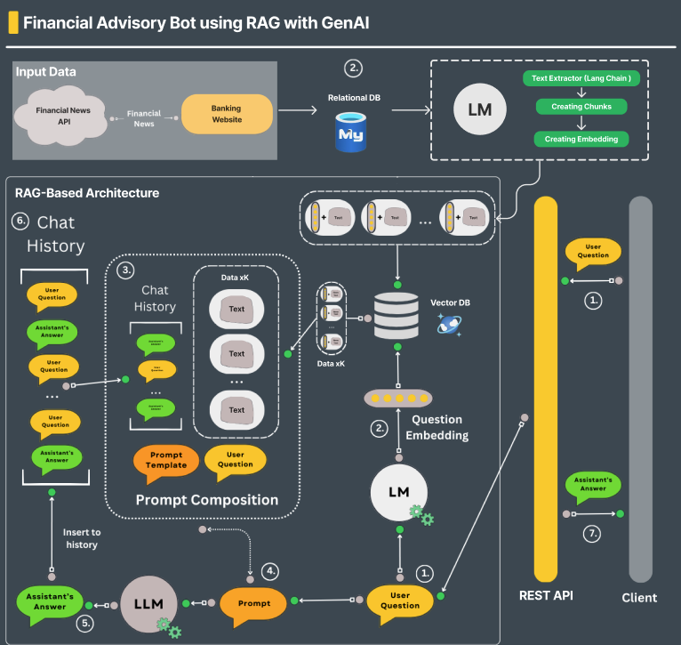
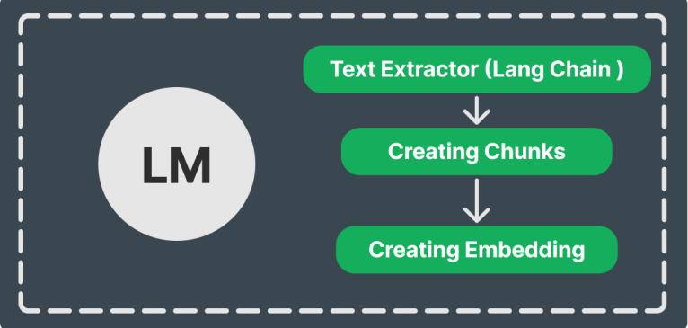
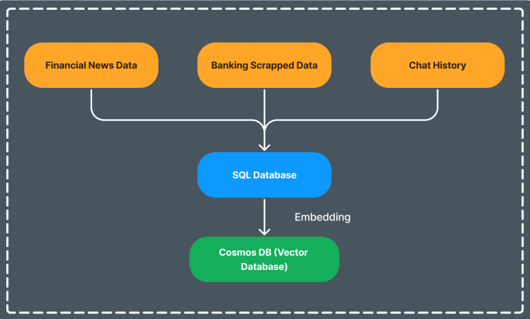
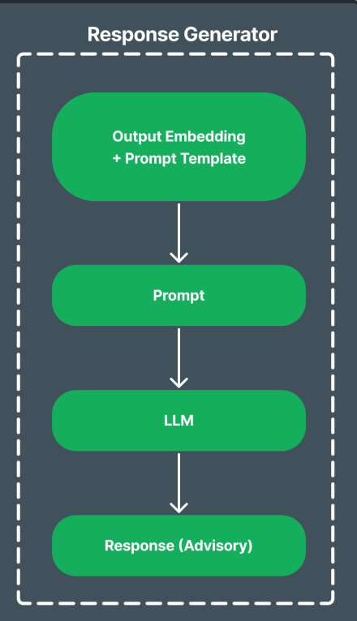
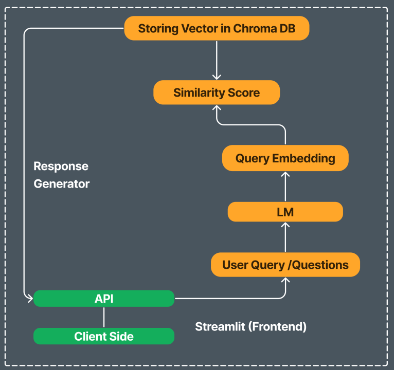
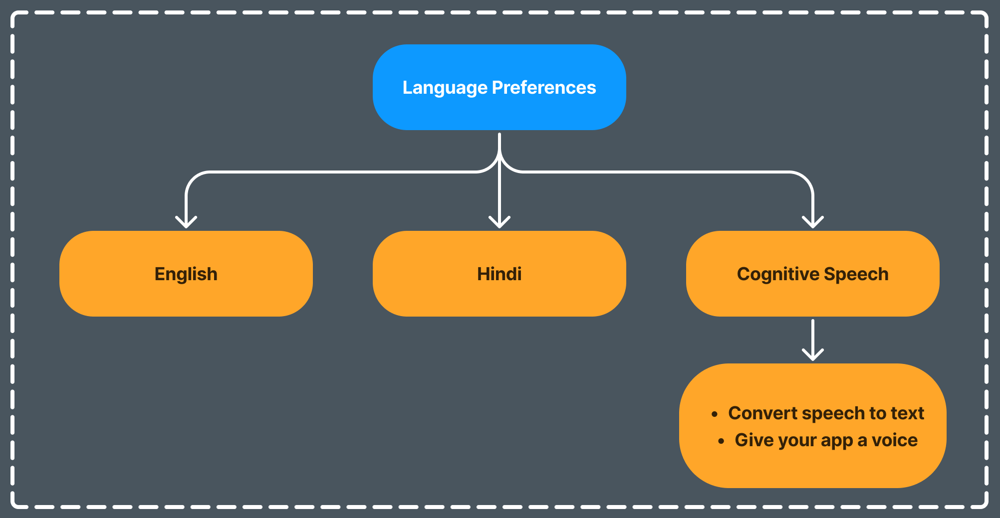

    <h2>Bank of Baroda Hackathon 2024</h2>
    <h1>Financial Advisory Bot using RAG with GenAI</h1>
    <i>by <a href="mailto:atharvamundke22@gmail.com">Atharva Mundke</a>, <a href="https://www.linkedin.com/in/shweta-nagapure-4612a2269/">Shweta Nagapurer</a>, <a href="https://www.linkedin.com/in/prasad-kumbhar-/">Prasad Kumbhar</a> and <a href="https://www.linkedin.com/in/virendra-bagul-141786250/">Virendra Bagul</a></i>

---
### Team Name: TeachX

### Team Members:
1. Atharva Mundke
2. Shweta Nagapure
3. Prasad Kumbhar
4. Virendra Bagul

---

# Table of Contents

- [1. Objective](#1-objective)
- [2. Challenges](#2-challenges)
- [3. Problem Statement](#3-problem-statement)
- [4. Solution Overview](#4-solution-overview)
- [5. Solution Architecture](#5-solution-architecture)
  - [5.1 Data Collection](#51-data-collection)
  - [5.2 Data Storage](#52-data-storage)
  - [5.3 User Interface and Interaction](#53-user-interface-and-interaction)
  - [5.4 Query Processing and Response Generation](#54-query-processing-and-response-generation)
- [6. Solution Workflow](#6-solution-workflow)
  - [6.1 User Query](#61-user-query)
  - [6.2 Question Embedding](#62-question-embedding)
  - [6.3 Information Retrieval](#63-information-retrieval)
  - [6.4 Prompt Composition](#64-prompt-composition)
  - [6.5 Response Generation](#65-response-generation)
  - [6.6 Assistance Response](#66-assistance-response)
- [7. Target Beneficiaries](#7-target-beneficiaries)
  - [7.1 Target Audience](#71-target-audience)
  - [7.2 Target Benefits](#72-target-benefits)
  - [7.3 Generalized Benefit for All Audiences](#73-generalized-benefit-for-all-audiences)
- [8. Accessibility](#8-accessibility)

---

## Financial Advisory Bot using RAG with GenAI

---

### 1. Objective
Transform financial advisory services through generative AI, delivering customized financial advice based on individualized data analysis. This approach utilizes advanced algorithms to interpret customer data and market trends, ensuring tailored recommendations that adapt to changing financial landscapes, ultimately enhancing client outcomes and satisfaction.

---

### 2. Challenges
1. Analyze customer financial data and market trends to generate tailored investment strategies.
2. Offer real-time advisory services that adapt to changing financial conditions and customer goals.
3. Ensure transparency and explainability in the AI-driven advisory process to build customer trust and confidence.

---

### 3. Problem Statement
In today's complex financial landscape, individuals struggle to access personalized, timely, and data-driven financial advice. Traditional advisory services are often expensive, not readily available 24/7, and may not always incorporate real-time market trends. There's a pressing need for an innovative solution that democratizes access to high-quality financial advice, adapts to changing market conditions, and aligns with individual financial goals.

---

### 4. Solution Overview
The Financial Advisory Assistant Bot aims to address this gap by delivering swift, precise, and context-aware financial advice using advanced AI technologies. Leveraging Retrieval-Augmented Generation (RAG) and Generative AI, this bot integrates real-time data from financial news and banking websites, stored in a MySQL relational database, to ensure up-to-date and accurate responses.

---

## 5. System Architecture

### 5.1 Data Collection:
- Web Scraping (for Banks Websites data): Collects financial information from relevant websites.
- APIs (for financial news): Gather current financial news from external sources.

### 5.2 Data Storage:
- Azure Database for MySQL: Stores and organizes collected information.
- LangChain Text Extractor: Processes stored data, extracting relevant textual information and breaking it into manageable chunks.
- Azure Cognitive Services' Text Analytics API: Converts text chunks into vectorized embeddings.
- Azure Cosmos DB: Stores vectorized embeddings for efficient retrieval.

### 5.3 User Interface and Interaction
- Streamlit: Provides a user-friendly interface for inputting financial questions
- Azure API Management: Manages REST API for secure communication between frontend and backend

### 5.4 Query Processing and Response Generation
- Backend Processing:
  1. Receives user questions via Azure API Management
  2. Converts questions to embeddings using Azure Cognitive Services Text Analytics API
  3. Retrieves relevant information by comparing embeddings in Azure Cosmos DB
- Prompt Composition:
  1. Azure Functions: Automates the prompt creation process
  2. Combines retrieved information, user question, and chat history
  3. Incorporates predefined templates for comprehensive prompts
- Response Generation
  1. Azure Machine Learning Service: Hosts the Large Language Model (LLM)
  2. Azure OpenAI Service: Utilizes advanced language models (GPT-3.5) to generate contextually accurate responses
- Response Delivery and History Management
  1. Generated responses are sent back to the Streamlit interface via the REST API
  2. Azure Cosmos DB: Maintains chat history for context preservation in future interactions

---

## 6. System Workflow

6.1. User Query: The process begins when a user inputs a financial question or request through the bot's client interface. This query could range from investment advice to inquiries about financial advice or market trends.

6.2. Question Embedding: Upon receiving the user's query, the system converts the text into a vector representation using embedding techniques. This embedding process translates the text into a format that can be processed and analyzed by the model.

6.3. Information Retrieval: The embedded query is used to retrieve relevant information from a Vector Database (Vector DB). This database contains preprocessed data points, such as financial news, market trends, historical data, Data from Banking Websites and user preferences, stored in vectorized form for efficient retrieval.

6.4. Prompt Composition: Using the retrieved information, along with contextual data from the user's chat history, predefined prompt templates, and the original user question, a comprehensive prompt is composed. 

6.5. Response Generation: The composed prompt is then fed into a Large Language Model (LLM). The LLM processes the prompt to generate a coherent and accurate response tailored to the user's query and current financial context.

6.6. Assistance Response: The generated response is delivered to the user through the bot's interface in a user friendly format. Additionally, the response is stored in the chat history, ensuring continuity and context preservation for future interactions with the user.

---

## 7. Target Beneficiaries

### 7.1 Target Audiences
1. Individual Investors
2. Financial Advisors and Planners
3. Small Business Owners
4. Retirees and Pre-Retirees
5. Young Professionals

### 7.2 Targeted Benefits

#### Individual Investors
- Personalized Advice: Tailored investment strategies based on individual financial goals, risk tolerance, and market conditions.
- Real-Time Updates: Adaptable advice that changes with market trends and personal financial situations.
- Transparency: Clear explanations of investment choices to build trust.

#### Financial Advisors and Planners
- Efficiency: Automates routine tasks, allowing advisors to focus on more complex client needs.
- Enhanced Insights: Provides data-driven insights and recommendations to supplement advisor expertise.
- Client Management: Helps in managing multiple clients and their portfolios more effectively.

#### Small Business Owners
- Financial Planning: Offers tailored advice for managing business finances, investments, and cash flow.
- Market Analysis: Provides insights on market trends relevant to the business sector.
- Growth Strategies: Helps in identifying investment opportunities for business expansion.

#### Retirees and Pre-Retirees
- Retirement Planning: Personalized strategies for managing retirement savings and income.
- Risk Management: Advice on balancing risk and return to protect retirement funds.
- Long-Term Goals: Helps in planning for healthcare costs, estate planning, and other long-term needs.

#### Young Professionals
- Early Investment: Encourages good financial habits and early investment strategies.
- Debt Management: Provides advice on managing student loans, credit card debt, and other liabilities.
- Savings Goals: Helps in setting and achieving short and long-term savings goals.

### 7.3 Generalized Benefit for all Audiences
- Personalized, Data-Driven Advice: Using Generative AI to analyze individual financial data and market trends to create customized financial strategies.
- Real-Time Adaptation: Implementing features that allow the bot to adjust advice based on real-time data fetched, market fluctuations, and changes in the user's financial status or goals.
- Transparency and Explainability: Developing a user-friendly interface that clearly explains the reasoning behind each piece of advice generated from the LLM in the Response, fostering trust and confidence in the AI's recommendations.

---

## 8. Accessibility
- Language Preferences: The system accommodates multiple languages (English, Hindi) making it accessible to a broader demographic.
- Accessibility: Cognitive Speech feature shows an advanced capability to handle speech input and output, enhancing user experience through voice interaction. It includes converting speech to text and giving your app a voice.

---
